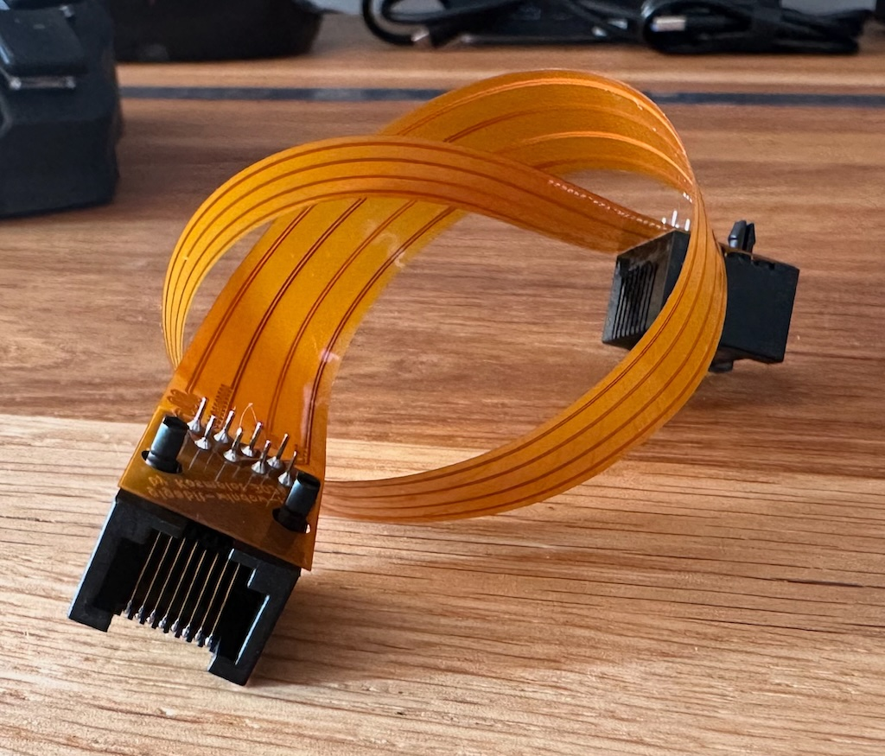
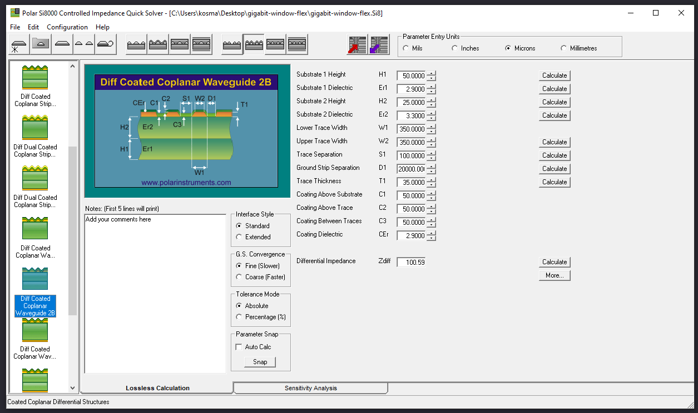
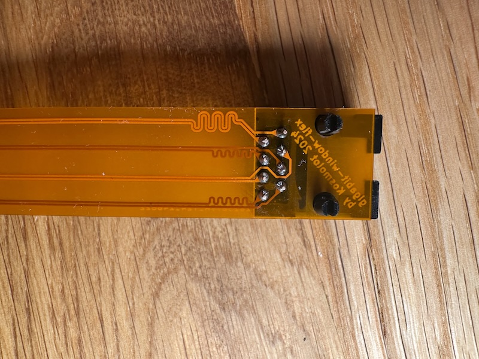
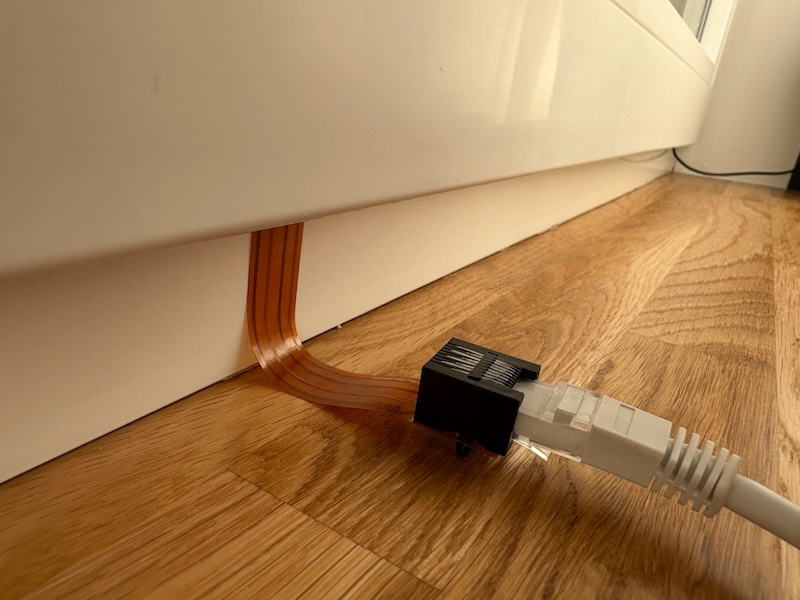

# Flex PCB Ethernet Window Passthrough

## Overview

If you ever tried buying an off-the-shelf window passthrough flex like this one, you probably were disappointed because it only paired at 100Mbps.
This project aims to fix that issue and provide you with glorious gigabit ethernet speed - inside *and* outside.
It was mainly designed to fit in windows, but it works with linux and macos too.
You can also use it in any other tight spaces ([H.Y.C.Y.BH.?](https://www.youtube.com/watch?v=--9kqhzQ-8Q)),
or as the world's weirdest Ethernet barrel. We won't judge. 

## Technical details

- Length: Flexible part is 265mm, but if you want you can customize it.
- Source: PCB was designed in KiCad.
- Length matching: yes (I was bored).
- Impedance matching: believe or not - but yes!

## Ordering

You can order this flex from [JLCPCB](https://jlcpcb.com/). Gerber files are **[here](production/gigabit-window-flex.zip)**. Use the default flex stackup.

## Credits

- Idea: [hbrylkowski](https://github.com/hbrylkowski)
- Design: [kosma](https://github.com/kosma)
- Paying to get the shit built: [hbrylkowski](https://github.com/hbrylkowski)

## Images

## License

This project is licensed under the MIT License. See the [LICENSE](LICENSE.md) file for details.
