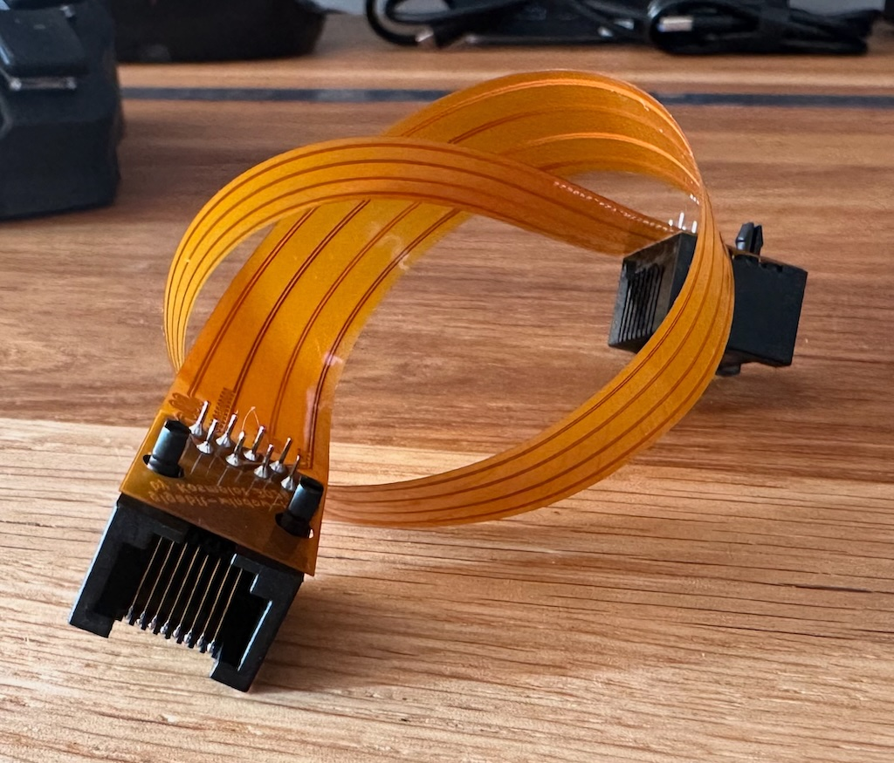
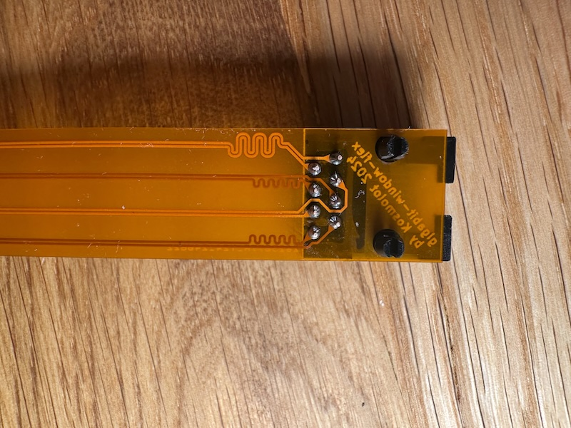
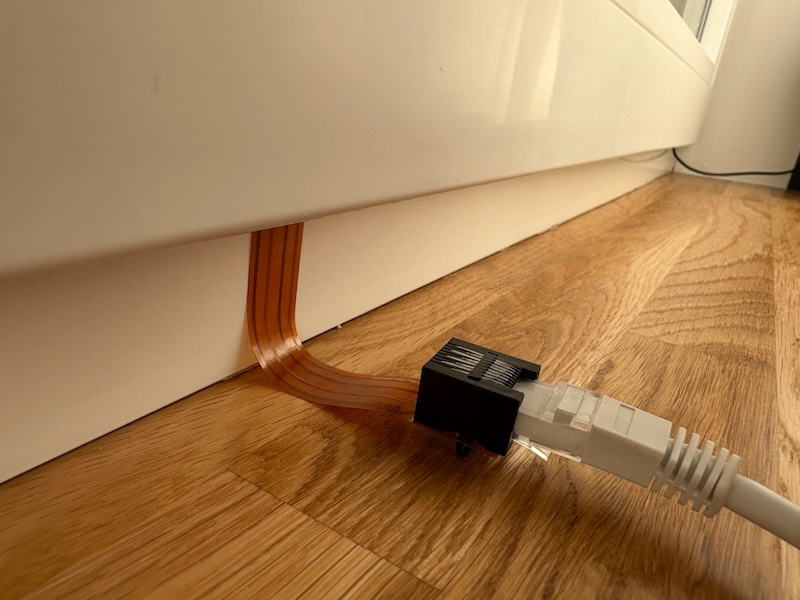

# Flex PCB Ethernet Window Passthrough

## Overview
If you ever tried buying ready window pass through flex like this one, you probably were disappointed because it only paired on 100Mbps.
This project aims to fix that issue and provide you with glorious gigabit ethernet speed. It was mainly designed to fit 
in windows, but it works with linux and macos too. You can also use it in any other tight spaces, or as the world weirdest ethernet barrel. We won't judge. 

## Technical details
- Length: Flexible part is 265mm, but if you want you can customize it.
- Source: PCB was designed in KiCad

## Ordering

You can order this flexes from [JLCPCB](https://jlcpcb.com/) Gerber files are  **[here](production/gigabit-window-flex.zip)**.

## Images

## License

This project is licensed under the MIT License. See the [LICENSE](LICENSE.md) file for details.
